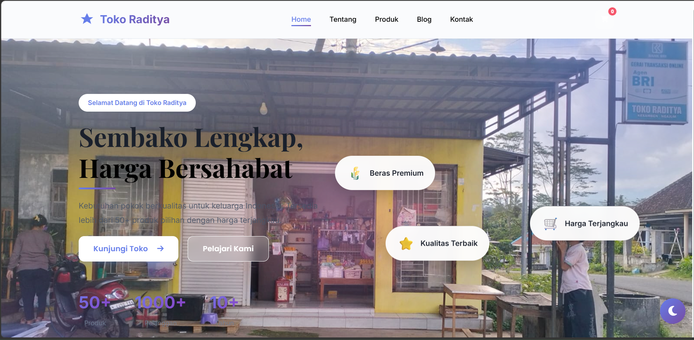
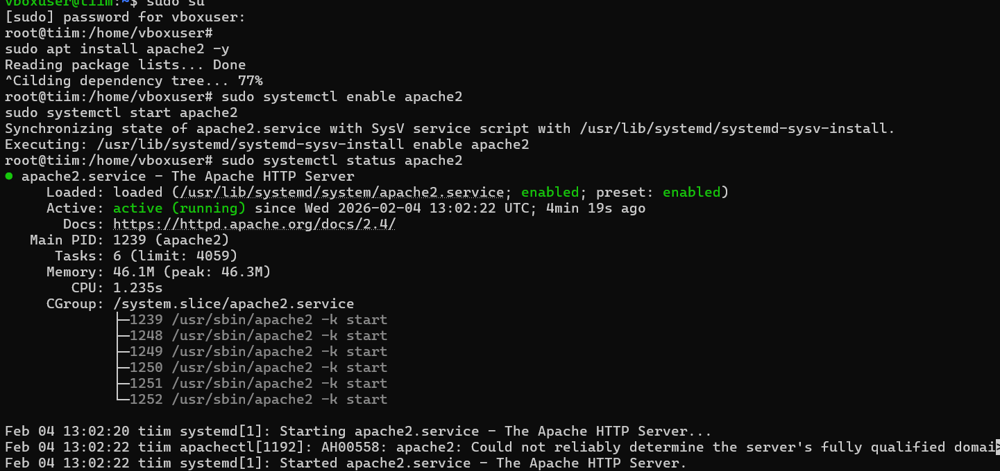
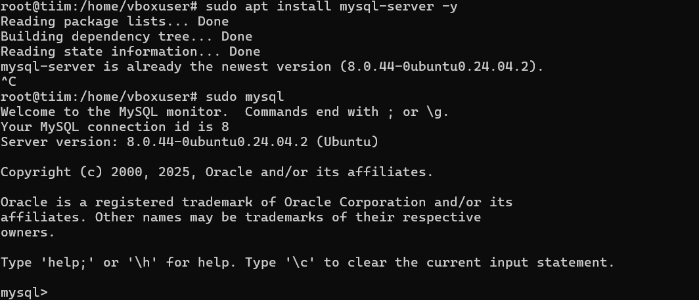
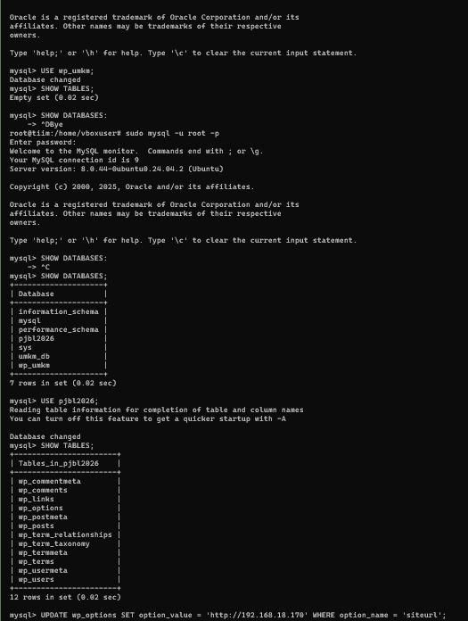
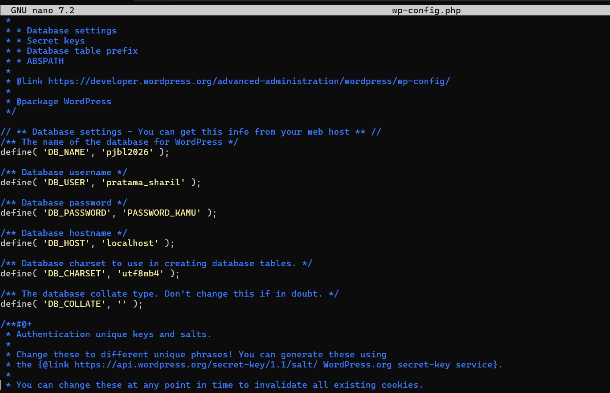
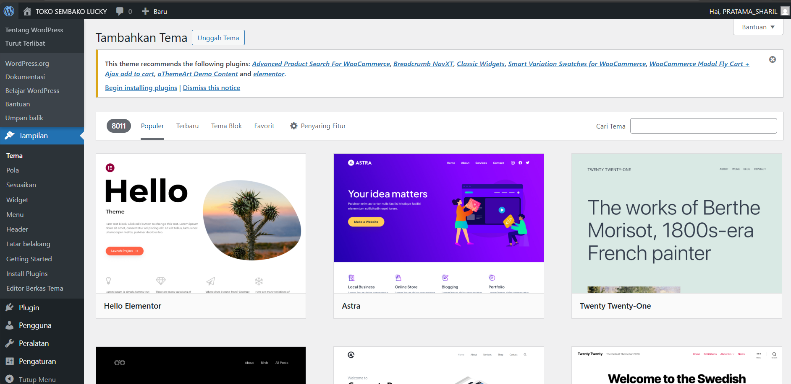

# 🖥️ Deploy WordPress di Ubuntu Linux — Proyek UKK


## 📌 Deskripsi Proyek

Proyek ini merupakan implementasi deployment website berbasis **WordPress** di atas server **Ubuntu Linux 24.04** menggunakan stack **Apache2, MySQL, dan PHP (LAMP)**. Website yang dibangun adalah **Toko Raditya** — toko sembako online lengkap dengan halaman produk, blog, dan kontak.

Proyek ini dikerjakan sebagai bagian dari **Uji Kompetensi Keahlian (UKK)** program Teknik Komputer dan Jaringan (TKJ) di SMK Negeri 4 Malang.

---

## 🛠️ Tech Stack

| Komponen | Detail |
|---|---|
| OS Server | Ubuntu Linux 24.04 LTS |
| Web Server | Apache2 |
| Database | MySQL 8.0.44 |
| CMS | WordPress (latest) |
| Editor Konfigurasi | GNU Nano 7.2 / VS Code |
| IP Server | 192.168.x.x (Local Network) |

---

## 📋 Tahapan Instalasi & Konfigurasi

### 1. Instalasi Apache2
```bash
sudo apt install apache2 -y
sudo systemctl enable apache2
sudo systemctl start apache2
sudo systemctl status apache2
```
Apache2 berhasil dijalankan dengan status **active (running)**.

---

### 2. Instalasi MySQL Server
```bash
sudo apt install mysql-server -y
sudo mysql -u root -p
```
MySQL versi **8.0.44-0ubuntu0.24.04.2** berhasil diinstall dan diakses.

---

### 3. Setup Database WordPress
```sql
-- Membuat database untuk WordPress
CREATE DATABASE pjbl2026;

-- Verifikasi database
SHOW DATABASES;

-- Verifikasi tabel WordPress setelah instalasi
USE pjbl2026;
SHOW TABLES;

-- Update siteurl jika diperlukan
UPDATE wp_options 
SET option_value = 'http://192.168.18.170' 
WHERE option_name = 'siteurl';
```
Database `pjbl2026` berhasil dibuat dengan 12 tabel WordPress standar (wp_posts, wp_users, wp_options, dll).

---

### 4. Download & Ekstrak WordPress
```bash
cd /var/www/html
sudo wget https://wordpress.org/latest.tar.gz
sudo tar -xzf latest.tar.gz
```

---

### 5. Konfigurasi wp-config.php
```php
// Database Settings
define('DB_NAME', 'pjbl2026');
define('DB_USER', 'pratama_sharil');
define('DB_PASSWORD', '**********');
define('DB_HOST', 'localhost');
define('DB_CHARSET', 'utf8mb4');

// URL Konfigurasi
define('WP_HOME', 'http://192.168.110.104');
define('WP_SITEURL', 'http://192.168.110.104');
```

---

### 6. Restart Services
```bash
sudo systemctl restart apache2
sudo systemctl restart mysql
```

---

### 7. Konfigurasi Tema & Tampilan
WordPress Admin Dashboard diakses untuk instalasi dan konfigurasi tema. Tema yang tersedia meliputi Hello Elementor, Astra, dan Twenty Twenty-One.

---

## 🌐 Hasil Website

Website **Toko Raditya** berhasil di-deploy dengan fitur:
- ✅ Halaman Home dengan hero section dan statistik toko
- ✅ Navigasi: Home, Tentang, Produk, Blog, Kontak
- ✅ Tampilan responsif dengan tema WordPress
- ✅ Integrasi WooCommerce untuk katalog produk
- ✅ Dark mode toggle

---

## 📸 Screenshots

### Tampilan Website (Frontend)
> Halaman utama Toko Raditya — website sembako online



---

### Konfigurasi Server (Backend)

| Instalasi Apache2 | MySQL Running |
|---|---|
|  |  |

| Database Tables | wp-config.php |
|---|---|
|  |  |

| Download WordPress | WordPress Admin |
|---|---|
|  |  |

---

## 📁 Struktur Repository

```
wordpress-ubuntu-vps-setup/
│
├── README.md                    ← Dokumentasi utama
│
└── screenshots/
    ├── website-frontend.png     ← Tampilan website jadi
    ├── apache-running.png       ← Apache2 active running
    ├── mysql-install.png        ← MySQL terinstall
    ├── database-tables.png      ← Tabel WordPress di MySQL
    ├── wp-config.png            ← Konfigurasi wp-config.php
    ├── wget-wordpress.png       ← Download WordPress via wget
    └── wp-admin-dashboard.png   ← Dashboard WordPress Admin
```

---

## 💡 Apa yang Dipelajari

- Instalasi dan konfigurasi **LAMP Stack** (Linux, Apache, MySQL, PHP) dari nol
- Manajemen **database MySQL** — create database, user, dan query dasar
- Konfigurasi **WordPress** secara manual via file wp-config.php
- Troubleshooting koneksi database dan URL konfigurasi WordPress
- Penggunaan **command line Linux** untuk administrasi server
- Deploy website **end-to-end** dari instalasi server hingga website live

---

## 👤 Tentang

**Pratama Budiansyah**  
Teknik Komputer dan Jaringan — SMK Negeri 4 Malang  
📧 pratamabudiansyah20@gmail.com  
🔗 [LinkedIn](https://linkedin.com/in/pratama-budiansyah)

---

> *Proyek ini dikerjakan sebagai Uji Kompetensi Keahlian (UKK) Tahun Pelajaran 2025/2026*
